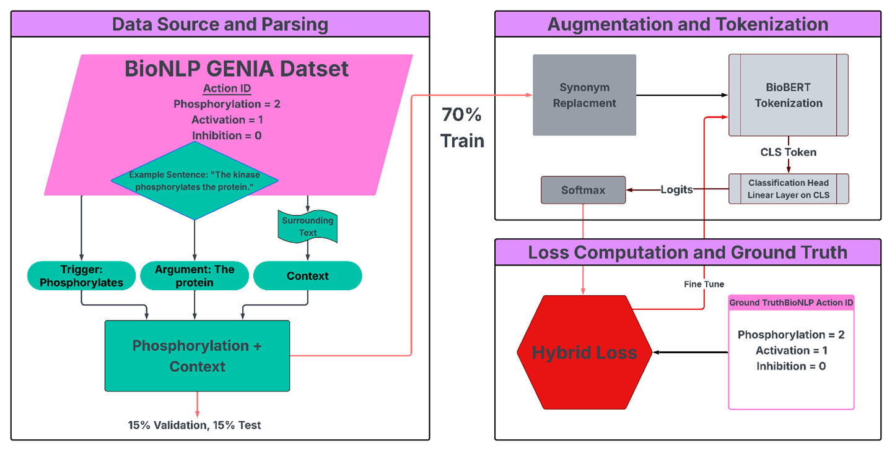

**Overview**
Biomedical event classification is a difficult challenge due to class imbalance and semantic overlap between event types. This project introduces a hybrid loss function that combines focal loss with Sinkhorn divergence to fine-tune a BioBERT-based  classification of biomedical events. In particular, we focus specifically on three biological processes: phosphorylation, inhibition and activation. We demonstrate the usefulness of this method using the BioNLP GENIA dataset. Our model architecture is built on a BioBERT base, and we fine-tune only the last two layers of BioBERT.

**Project Structure**
BioBERTHybridLoss/
├── data/
├── figures/
├── notebook/
├── README.md
└── requirements.txt

**Features**
Hybrid Loss Function: Combines focal loss and Sinkhorn distance to mitigate class imbalance while encoding domain-specific structure via a biologically informed cost matrix.

BioBERT Fine-Tuning: Custom fine-tuning on BioBERT on the BioNLP GENIA 2013 dataset for event extraction tasks involving activation, inhibition and phosphorylation.

Mechanistically Informed Cost Matrix: Introduces biological priors into the loss function, penalizing misclassifications based on mechanistic distances between event types.

Synonym Augmentation: Implements WordNet synonym augmentation to improve trainign distribution balance for minority classes. 

Training Optimization: Includes cosine annealing scheduler, early stopping, and class-weighting via the effective number of samples. 

Eval Metrics and Visuals: Includes precision, recall, F1-score, and visualizations of training performance, confusion matrices, and class-specific improvements. 

  

