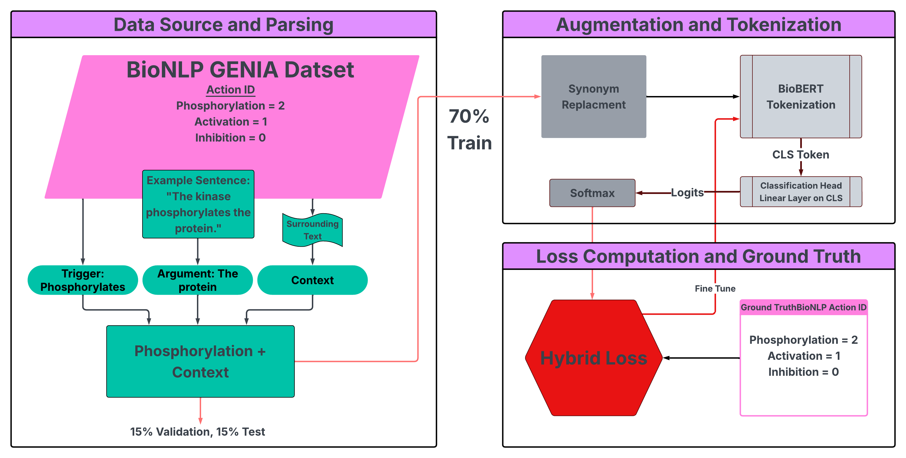

BioBERTHybridLoss: Hybrid Loss for Biomedical Event Extraction Using BioBERT

**BioBERTHybridLoss** is an open-source framework that enhances biomedical event classification by combining **focal loss** with **Sinkhorn divergence** embedding biological knowledge into model training. Built on **BioBERT**, the model is fine-tuned on the **BioNLP GENIA 2013** dataset and targets three critical event types: **phosphorylation**, **activation**, and **inhibition**. This hybrid loss method improves performance on underrepresented classes and minimizes biologically implausible misclassifications.

<p align="center">
  
</p>

---
Features

- **Hybrid Loss Function:** Combines focal loss (for class imbalance) with Sinkhorn divergence (for structural biological penalties).
- **BioBERT Fine-Tuning:** Fine-tunes the final two layers of BioBERT for domain-specific adaptation using GENIA 2013 biomedical events.
- **Mechanistically Informed Cost Matrix:** Encodes biologically meaningful distances between event types (e.g., inhibition vs phosphorylation).
- **Synonym-Based Augmentation:** Uses WordNet-driven synonym replacement to improve balance in training data for rare event classes.
- **Training Optimization:** Incorporates cosine annealing, early stopping, and effective sample-based class weighting.
- **Rich Evaluation & Visuals:** Outputs detailed precision, recall, and F1-score with learning curves and confusion matrices for interpretability.

---

Quick Start

1. **Clone the Repository**
    ```bash
    git clone https://github.com/yourusername/BioBERTHybridLoss.git
    cd BioBERTHybridLoss
    ```

2. **Install Dependencies**
    ```bash
    pip install -r requirements.txt
    ```

3. **Train the Model**
    ```bash
    python train.py --loss hybrid --lambda 1
    ```

4. **Evaluate**
    ```bash
    python evaluate.py --model checkpoints/best_model.pt
    ```

---

Dataset

We use the **BioNLP Shared Task GENIA 2013** dataset (via BigBio). The model focuses on:

- **Phosphorylation** (label `2`)
- **Activation** (label `1`)
- **Inhibition** (label `0`)

Each input includes the event trigger and up to 1500 characters of document context, tokenized using BioBERT’s tokenizer.

---
Project Structure

```plaintext
BioBERTHybridLoss/
├── data/            # Preprocessed GENIA dataset and augmented samples
├── figures/         # Workflow diagram, confusion matrices, etc.
├── notebook/        # Jupyter notebooks for training and analysis
├── README.md        # Project documentation
└── requirements.txt # Python dependencies

